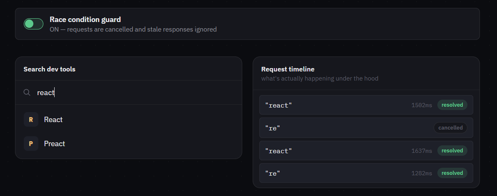

# Machine Coding Interaction #02 — Typeahead

**[Live demo](https://deyrupak.github.io/machine-coding-interactions/02-typeahead/)** · Standalone HTML/CSS/JS, no build step, no dependencies.


---

> Machine Coding Interaction #02: Typeahead
>
> Slow requests can resolve after fast ones — and silently overwrite the right results with stale ones.
>
> The hard part isn't debouncing.
>
> It's cancelling in-flight requests and guarding against out-of-order responses.
>
> ```js
> controller?.abort()
> controller = new AbortController()
> const id = ++requestId
> const res = await fetch(url, { signal: controller.signal })
> if (id !== requestId) return // a newer request already started
> render(res)
> ```

---

## The problem

Type "re", then quickly "react". Two requests go out. Networks don't guarantee order — the "re" request can take longer and resolve *after* the "react" request. If the code just does `promise.then(render)` for both, whichever one finishes last wins, even if it's answering a query nobody's asking anymore. The UI ends up showing results for "re" while the input still says "react."

This demo makes that failure mode something you can actually watch happen, instead of taking it on faith: flip the **race condition guard** off, type a few characters quickly, and the "ignored — stale" badges in the timeline turn into "resolved" badges that silently overwrite good results with wrong ones.

## Engineering decisions

**A monotonic request ID, not just cancellation.** `AbortController` cancels the network call, but the guard that actually prevents stale renders is simpler and more robust: increment a counter on every new request, and only render a response if its ID still matches the latest one issued. This works even in situations where cancellation isn't available at all (some APIs, some environments) — it's a stronger and more portable guarantee than "did the abort succeed."

**Both together, not one or the other.** Abort alone stops wasted work but a non-cancellable request (or a race in exactly how/when the abort fires) could still resolve. The ID guard alone would let a stale request's browser/network work run to completion for nothing. Using both means the browser stops wasted work *and* the rendering logic can't be fooled even if it doesn't.

**A toggle instead of just describing the bug.** It's one thing to say "responses can arrive out of order" — it's another to type into a box and watch it happen. The toggle exists specifically so the failure mode isn't hypothetical; the guard's value should be obvious within a few seconds of using it with the toggle off.

**Debounce delay (250ms) vs. request latency (300–1800ms simulated).** These are deliberately close enough that fast typing plus a slow simulated response genuinely produces overlapping in-flight requests — the demo doesn't need to fake or force a race condition, normal use produces one often enough to see live.

**Spinner delay, not instant.** The loading spinner only appears if a request is still pending after 150ms. A request that resolves faster than that never shows a spinner at all — avoiding the flash-of-loading-state that makes fast, healthy responses feel janky.

**Error handling is scoped to the current request.** A failed request only shows the error UI (with retry) if its ID is still the latest one — an old, already-superseded request failing shouldn't interrupt whatever the user is looking at now.

## Harder variations

Called out as comments in the code too:

- **Real cancellation, not just cleanup bookkeeping.** This demo's "network" is a local `Promise`, so `clearTimeout` stands in for aborting a request. Against a real API, the same `AbortController`'s `signal` gets passed straight into `fetch()` so the browser actually tears down the in-flight HTTP request, not just the local state.
- **Cache-and-revalidate.** On a repeated query, show the last cached result for it instantly, then replace it if a fresh response resolves. Trades strict correctness-during-flight for perceived speed — and needs its own cache invalidation strategy.
- **Cleanup on unmount.** In a real component (React or otherwise), the outstanding request needs to be aborted in a cleanup path (e.g. a `useEffect` return function) — otherwise a component that's gone can still try to update state that no longer exists.

## Running locally

No build step. Clone the repo and open `index.html` directly, or serve the folder:

```
npx serve .
```