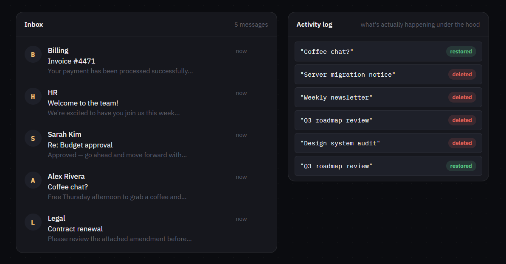

# Machine Coding Interaction #03 — Undo/Redo (Optimistic Delete)

**[Live demo](https://deyrupak.github.io/machine-coding-interactions/03-undo-redo/)** · Standalone HTML/CSS/JS, no build step, no dependencies.


---

> Machine Coding Interaction #03: Undo/Redo
>
> The hard part isn't the "Undo" toast.
>
> It's delaying the real mutation until the undo window closes — while the UI already looks committed.
>
> ```js
> function deleteItem(id) {
>   const i = items.findIndex(x => x.id === id)
>   const nextId = items[i + 1]?.id ?? null   // anchor, not a raw index
>   const [item] = items.splice(i, 1)
>   pending.set(id, { item, nextId, timer: setTimeout(() => commit(id), 5000) })
> }
> ```
>
> Delete optimistically. Commit on a timer. Restore next to where it actually was.

---

## The problem

The tutorial version of undo is: delete the item, show a toast, and if "Undo" gets clicked, re-insert a copy of it. That's not undo — it's "delete now, maybe re-create later," and it quietly breaks in two ways. First, if the delete is actually sent to a server immediately, clicking undo doesn't undo anything real; it just fakes it client-side while the server thinks the item is gone. Second, "re-insert" usually means "append to the end," which puts the item back in the wrong place.

The pattern that's actually correct: the UI removes the item immediately (optimistic), but the *real* mutation — the thing that would hit a server, or otherwise be irreversible — is deferred behind a timer. Undo just cancels that timer and puts the item back. Nothing was ever really deleted until the window closed, so there's nothing to reconstruct.

## Engineering decisions

**Deferred commit, not deferred UI.** The item disappears from the list the instant you click delete — that part has to be instant, or the app feels laggy. What's deferred is the thing that makes it permanent. This is the actual "optimistic" part: the UI is ahead of the real state, on purpose, for exactly `UNDO_WINDOW_MS`.

**Anchor to a neighbor's id, not a numeric index.** The first version of this is usually "remember the array index, splice it back in later." That works for exactly one pending delete at a time. Delete a second item before the first one's undo window closes, and the remembered index for the first item no longer points at the right spot — the list has shifted underneath it. Anchoring to the id of the item that was immediately after it sidesteps this: on undo, look up wherever that neighbor currently lives (it may have moved, or also be mid-delete) and insert right before it. If the neighbor's gone too, it falls back to the end.

**A `pendingOrder` array drives ⌘Z, not the `pending` Map.** `Map` iteration order isn't the right thing to reach for when "undo the most recent delete" needs a clear, explicit "most recent" — a small ordered array of ids, pushed on delete and spliced on resolution, makes that unambiguous.

**Toasts are stacked and independent.** Delete three items quickly and you get three toasts, each with its own timer and its own draining progress bar. Undoing the second one doesn't touch the other two — every pending delete is tracked and resolved completely independently.

**The progress bar's timing has to match the real timer, not just look plausible.** The toast's fill animation runs for exactly `UNDO_WINDOW_MS` — the same constant driving `setTimeout`. It's a small detail, but a progress bar that doesn't actually reach zero when the action becomes irreversible is worse than no progress bar at all.

## Harder variations

Called out as comments in the code too:

- **A real undo/redo stack.** This demo only reverses deletes. A general version tracks every mutation type (edit, reorder, delete) as entries in one history array with a pointer, so `⌘Z` / `⌘⇧Z` walk backward and forward through it — redo re-applies an entry the same way undo reverses it, rather than being a separate code path.
- **Server commit can fail.** This demo's "commit" is a no-op timer. In reality, the undo window closing triggers a real request, which can fail *after* the client has already treated the item as gone. The UI needs to reconcile that — most likely by re-inserting the item with an error state, rather than pretending the delete succeeded.
- **Batch delete.** Select several items, delete them together, get one toast — and Undo restores the whole group. That means tracking a pending *group* (each item's own anchor, all sharing one timer) instead of one id per timer.

## Running locally

No build step. Clone the repo and open `index.html` directly, or serve the folder:

```
npx serve .
```