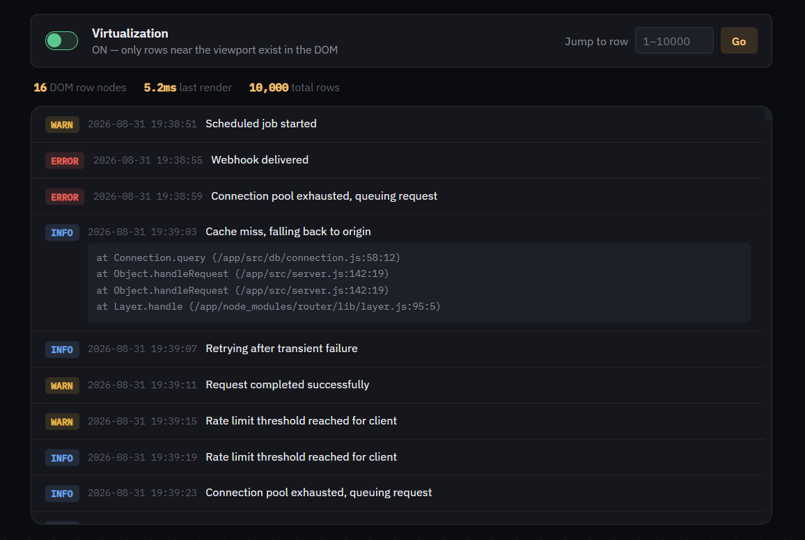

# Machine Coding Interaction #04 — Virtualized List

**[Live demo](https://deyrupak.github.io/machine-coding-interactions/04-virtualized-list/)** · Standalone HTML/CSS/JS, no build step, no dependencies.


---

> Machine Coding Interaction #04: Virtualized List
>
> The hard part isn't rendering fewer DOM nodes.
>
> It's keeping scroll position, scrollbar size, and "jump to row" math correct — when the DOM only contains a sliver of the real list, and every row can be a different height.
>
> ```js
> // Fenwick tree: O(log n) row lookup by scroll offset,
> // even as individual row heights get corrected live.
> findIndex(target) {
>   let idx = 0, bitMask = highestPowerOfTwoLEn;
>   for (; bitMask > 0; bitMask >>= 1) {
>     const next = idx + bitMask;
>     if (next <= n && tree[next] <= target) {
>       idx = next;
>       target -= tree[next];
>     }
>   }
>   return idx; // the row containing this scroll offset
> }
> ```

---

## The problem

"Only render the visible rows" sounds like the whole problem, and for a list where every row is exactly the same height, it basically is — the math is `Math.floor(scrollTop / rowHeight)`. The moment rows vary in height (which almost every real list does — wrapped text, expandable content, media of different sizes), that formula stops working, and most naive attempts either fall back to measuring *everything* upfront (defeating the purpose of virtualizing in the first place) or get the scrollbar and jump-to-index math subtly wrong.

The actual problem has three parts: know where a given row sits without measuring the whole list, keep the real scrollbar accurate even though the DOM only contains a sliver of the data, and do all of this fast enough that scrolling doesn't stutter while heights are still being discovered.

## Engineering decisions

**A Fenwick tree (binary indexed tree) over row heights, not a plain prefix-sum array.** A plain array of cumulative offsets is easy to query but expensive to update — changing one row's height means recomputing every offset after it, an O(n) walk on a list of 10,000. A Fenwick tree supports both "what's the total height before row i" and "update row i's height" in O(log n), which matters here because heights get corrected individually and continuously as rows scroll into view for the first time.

**Estimate, render, measure, correct — not measure-before-render.** Every row gets an estimated height up front based on its type (compact vs. expanded), which is enough to position everything and get scrolling working immediately. Once a row is actually rendered, its real DOM height is measured, and if it differs from the estimate, the Fenwick tree is updated and that one row (and everything after it) gets repositioned. This is why expanded rows — whose real height depends on how many extra lines they got, not just their type — can still be handled correctly without ever measuring all 10,000 rows upfront.

**Every row is measured exactly once.** A `measured` flag per row prevents re-measuring rows that have already been corrected, which is what keeps the "render → measure → correct → re-render" loop from becoming an infinite layout-thrashing cycle. It runs at most twice per scroll frame: once to paint an estimate-based position, once to correct it if needed.

**The spacer div is what makes the scrollbar honest.** The visible rows are absolutely positioned (`transform: translateY(...)`) inside a container whose height is set to the Fenwick tree's running total. The browser computes scrollbar size and scroll range from that container's height — not from how many DOM nodes happen to exist inside it — so the scrollbar stays proportionally correct even though 9,970+ of the 10,000 rows aren't in the DOM at any given moment.

**Overscan exists purely to hide the seam.** Rendering exactly the rows that are geometrically visible means a fast scroll can outrun the render and show a blank flash at the edge for a frame. A small buffer of extra rows above and below the visible range (`OVERSCAN`) means there's already-rendered content ready the instant the viewport catches up.

**Jump-to-row can land on an estimate, and that's fine.** Scrolling directly to row #8,000 uses whatever heights are currently known for the rows between here and there — some of which may still be estimates if they've never been rendered. The very next measurement pass corrects any drift. This is the same trade-off real virtualization libraries make; a small resettle is preferable to blocking navigation on measuring thousands of unrendered rows first.

## Harder variations

Called out as comments in the code too:

- **Bidirectional infinite loading.** Prepending rows above the current scroll position (e.g. "load older entries") must not visually shift what's already on screen — `scrollTop` has to be adjusted by exactly the height of what got inserted above it, in the same frame, before the browser paints.
- **Grid virtualization.** Virtualize both axes for a spreadsheet-like view, so the DOM only ever holds `visible_rows × visible_columns` cells rather than a full row or column.
- **Sticky group headers.** Headers like "Today" / "Yesterday" that stay pinned while their section scrolls past, swapped out as virtualized rows carrying the next header enter view.

Also worth knowing: this demo rebuilds the visible slice's HTML on every scroll frame for clarity. Production libraries (react-window, TanStack Virtual) pool and reuse actual DOM node instances instead of recreating them — a real optimization on top of everything here, just not necessary to demonstrate the core geometry problem.

## Running locally

No build step. Clone the repo and open `index.html` directly, or serve the folder:

```
npx serve .
```