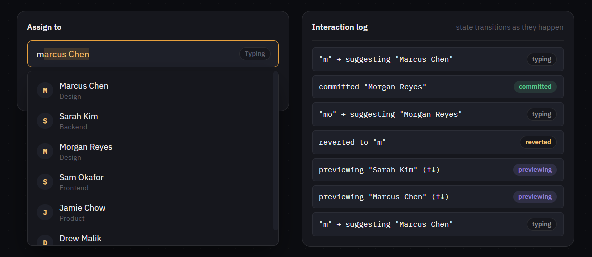

# Machine Coding Interaction #05 — Combobox

**[Live demo](https://deyrupak.github.io/machine-coding-interactions/05-combobox/)** · Standalone HTML/CSS/JS, no build step, no dependencies.


---

> Machine Coding Interaction #05: Combobox
>
> Arrow keys preview a suggestion into the input. Escape has to undo that — back to exactly what you typed, not an empty box.
>
> The hard part isn't filtering.
>
> It's keeping "previewing" and "committed" as genuinely different states.
>
> ```js
> function previewOption(option) {
>   input.value = option.label  // shown, not committed
> }
> function revertPreview() {
>   input.value = typedValue    // exactly what they typed — not cleared
> }
> ```

---

## The problem, and how it differs from #01 and #02

This series has already covered keyboard-driven filtering twice — a command palette (#01) and a typeahead (#02) — so it's worth being precise about what's actually new here. A command palette's input never means anything on its own; it's purely a filter string in a modal that closes when you're done. Typeahead's hard part is async ordering, and it never touches the input's value at all. A combobox is different in one specific way: **the input's own text has to represent a value that might not be committed yet**, live, while the user is still interacting.

Concretely: press ArrowDown and an option's full name appears in the input. That's not a selection — it's a preview. If you press Escape, the field needs to go back to exactly what you'd typed before you started arrowing, not clear itself, not keep the previewed name. Get this wrong (most comboboxes do) and Escape either does nothing, clears the whole field, or leaves the previewed value sitting there as if it had been chosen.

## Engineering decisions

**Three real states, not two.** It's tempting to model this as "input has a value" / "input is empty," but that collapses two genuinely different things: a value the user is still actively typing/exploring, and a value they've explicitly accepted. This demo tracks `typing`, `previewing`, and `committed` explicitly (visible in the badge next to the input and in every log line) because the correct behavior for Enter, Escape, and blur is different in each one.

**`typedValue` is captured once per preview session, not on every arrow press.** The first time an arrow key moves from `typing` into `previewing`, whatever the user had actually typed gets saved. Every subsequent arrow press while still previewing does *not* re-save it — otherwise arrowing from option 2 to option 3 would silently overwrite the thing Escape is supposed to restore.

**Inline ghost-text completion reuses the browser's native text selection — it doesn't reimplement it.** When a suggestion is appended to what the user typed, it's inserted as a real selected range (`input.setSelectionRange`), not a separately styled overlay element. That means typing the next character "just works" through ordinary browser behavior (a keystroke replaces a selection automatically) instead of requiring custom logic to detect and strip a fake suggestion on every keystroke.

**A new ghost suggestion is only offered on insertion, never on deletion.** If a suggestion is selected and the user presses Backspace, the browser deletes just that selection — the typed prefix is untouched. Re-suggesting the exact same match immediately afterward would leave the field looking unchanged, making Backspace appear broken. Checking `event.inputType` (`insertText` vs. `deleteContentBackward`/`deleteContentForward`) distinguishes the two, and deletions are left alone to actually shrink the field — matching how real address-bar autocomplete behaves.

**Preview and ghost-text are two different mechanisms that happen to look similar.** Ghost-text (from typing) is a *selected* suffix appended to what you typed — it's still fundamentally your text plus a proposal. Arrow-key preview replaces the entire input value with an option's full label and leaves nothing selected. They're visually distinguishable on purpose, and only one is ever active at a time.

**Blur never leaves an ambiguous value sitting in the field.** On blur, exactly one of two things happens: the current text exactly matches an option (case-insensitive) and gets committed, or it doesn't and the field reverts to the last real commitment (clearing if there wasn't one). The alternative — leaving arbitrary free text in the field looking like a selection — is the single most common way comboboxes end up silently wrong in production.

**Options use `mousedown` + `preventDefault()`, not `click`.** Clicking a listbox option would otherwise blur the input first (since focus is moving to the option), which triggers the blur-revert logic *before* the click's own handler runs — a classic combobox bug. Intercepting `mousedown` and preventing the default keeps focus on the input the entire time, so blur never fires from a click that was actually a selection.

## Harder variations

Called out as comments in the code too:

- **Multi-select (tags/chips).** Committing an option adds a chip and clears the input for the next entry; Backspace on an empty input removes the most recently added chip. The state machine stays mostly the same — commit targets a list instead of a single value.
- **Async suggestions.** Combine this with #02's request-cancellation pattern: listbox options come from a debounced network call, but inline ghost-text completion still needs to feel instant — which usually means it can only complete against options that have already arrived, not ones still in flight.
- **Grouped/sectioned suggestions.** Options grouped by role, where ArrowUp/ArrowDown skip over group-label rows instead of landing on them (a callback to #01's `aria-activedescendant` navigation, applied to a taller tree of rows).

## Known simplification

Inline ghost-text completion here assumes the caret is at the end of the input. Real-world implementations typically guard against completing while the user is editing in the middle of the text (e.g. via `selectionStart`/`selectionEnd` checks before offering a suggestion) — omitted here to keep the core state machine the focus.

## Running locally

No build step. Clone the repo and open `index.html` directly, or serve the folder:

```
npx serve .
```