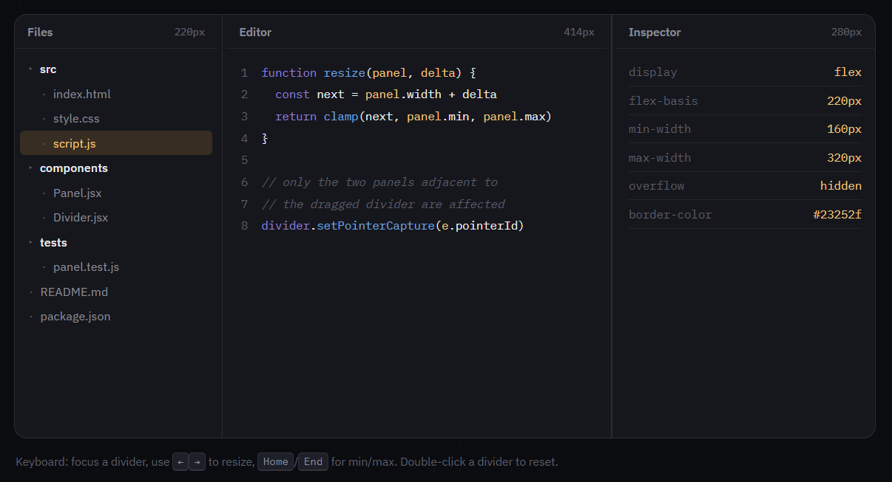

# Machine Coding Interaction #06 — Resizable Panels

**[Live demo](https://deyrupak.github.io/machine-coding-interactions/06-resizable-panels/)** · Standalone HTML/CSS/JS, no build step, no dependencies.


---

> Machine Coding Interaction #06: Resizable Panels
>
> The hard part isn't `mousemove`.
>
> It's `setPointerCapture` — no document-level listeners, no cleanup, drag never gets "stuck" outside the window. Plus clamping to min/max without disturbing the panel the user isn't touching.
>
> ```js
> divider.addEventListener('pointerdown', (e) => {
>   divider.setPointerCapture(e.pointerId)
>   startX = e.clientX
>   startWidth = panel.getBoundingClientRect().width
> })
>
> divider.addEventListener('pointermove', (e) => {
>   if (!divider.hasPointerCapture(e.pointerId)) return
>   resize(clamp(startWidth + (e.clientX - startX), MIN, MAX))
> })
> ```

---

## The problem

The textbook implementation attaches `mousemove` and `mouseup` to `document` the moment a drag starts on the divider, because the pointer inevitably moves faster than the 9px-wide divider element and ends up somewhere else on the page mid-drag. That works, but it's compensating for a problem that doesn't need to exist: `setPointerCapture` tells the browser to route every subsequent event for that pointer ID to the element that captured it, no matter where the cursor physically is — including outside the browser window. No `document` listeners to attach and later remove, no risk of a `mouseup` that fires after the pointer has left the window and never gets seen, no drag that's still "active" because a cleanup step got skipped.

The second real problem is layout math: translating a raw pixel delta into a new panel width, while making sure that width never disturbs a panel the user isn't actually dragging, and never squeezes a *different* panel (the flexible one in the middle) below its own minimum either.

## Engineering decisions

**One flexible panel, two fixed ones — not three explicit widths.** Files and Inspector have real pixel widths (`flex-basis`). Editor is `flex: 1 1 auto` and just absorbs whatever's left. This is what actually guarantees "a divider only affects its two immediate neighbors": there's no redistribution algorithm to write, because only one panel in the whole layout is ever flexible, and it's always one of the two neighbors touching any given divider.

**Clamping isn't static — it depends on the *other* panel's current width.** A divider's upper bound isn't just its own configured max; it's `min(own max, however much room is left before Editor would drop below its floor)`. That ceiling is recalculated on every drag frame from the live container width and the other fixed panel's current size, not baked in as a constant — drag Files wide enough and its effective max shrinks in real time as Inspector's width comes into play.

**`dirSign` exists because "drag right" means opposite things to the two dividers.** The Files divider is on the left panel's right edge — dragging right grows Files. The Inspector divider is on the right panel's left edge, and Inspector is anchored to the container's right edge — dragging right *shrinks* Inspector. Same raw pointer delta, opposite effect on width. Rather than duplicating the drag-handling logic with the sign flipped by hand, a single `wireDivider()` function takes a `dirSign` of `+1` or `-1` and both dividers share identical pointer/keyboard code.

**Keyboard resize is a first-class path, not an afterthought.** Each divider is `role="separator"`, focusable, and responds to arrow keys (with Shift for a larger step) and Home/End — going through the exact same `clamp()` + `applyWidths()` functions the pointer drag uses, so there's no separate, potentially-inconsistent code path for keyboard vs. mouse users.

**Cursor and text-selection are handled globally during a drag, not just on the divider.** Fast pointer movement during a drag would otherwise select surrounding text in the panels, and the `col-resize` cursor would flicker if it were scoped only to the divider element itself (which the pointer isn't always technically inside, even while captured). A `resizing` class on `<body>` fixes the cursor and disables selection for the drag's duration, removed the instant it ends.

**Re-clamping on window resize, not just on drag.** If the browser window shrinks while nothing is being dragged, nothing prevents the previously-valid Files/Inspector widths from squeezing Editor below its minimum. A `resize` listener re-runs both clamp functions against the new container width so the layout stays valid even when the user isn't touching a divider at all.

## Harder variations

Called out as comments in the code too:

- **Persisted layout.** Save panel widths to `localStorage` and restore them before first paint, so a reload doesn't flash back to defaults.
- **Nested splits.** A panel that's itself split (e.g. Editor divided into Code/Console) needs the same min/max-against-a-flexible-sibling clamping this demo does at the outer level, applied independently at each level of nesting.
- **Collapse threshold.** Dragging a panel far enough below its own minimum snaps it fully closed (width 0, hidden) instead of clamping at the floor — the way VS Code's sidebar collapses rather than just stopping at a minimum width.

## Running locally

No build step. Clone the repo and open `index.html` directly, or serve the folder:

```
npx serve .
```